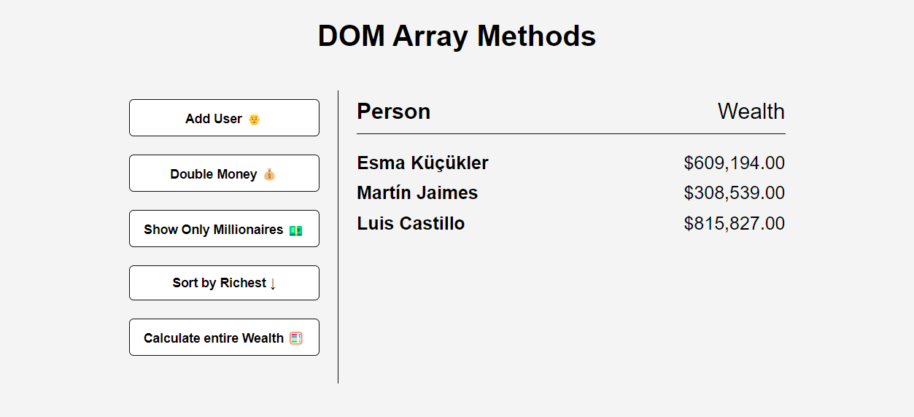

# Udemy--vanillawebprojects-05

**The fifth** of a series of **20 small projects** in **Vanilla JavaScript** from the [**Udemy course**](https://www.udemy.com/course/web-projects-with-vanilla-javascript/) by author [Brad Traversy](https://www.traversymedia.com/) with this [Brad's original GitHub repository](https://github.com/bradtraversy/vanillawebprojects).

# 05: DOM Array Methods Project

Project to teach high order array methods and DOM manipulation

## Project Specifications

- Fetch random users from the [randomuser.me](https://randomuser.me/) API
- Use **forEach()** to loop and output user/wealth
- Use **map()** to double wealth
- Use **filter()** to filter only millionaires
- Use **sort()** to sort by wealth
- Use **reduce()** to add all wealth

## Original preview

    

## My solution preview

    

## My solution features

- Custom **UI/UX design**
- My **FREE API KEY** is no longer working (must be replaced - after your registration on [https://app.exchangerate-api.com/](https:/********/app.exchangerate-api.com/) ) -> replace "const myCurrentAPIkey = ' \*\* \*\* \*\* \*\* \*\* ** ' in **script.js\*\* .
- **FontAwesome** icons

# Author

Website - [Petr Bednarski](https://github.com/pettik)  
Frontend Mentor - [@pettik](https://www.frontendmentor.io/profile/pettik)
