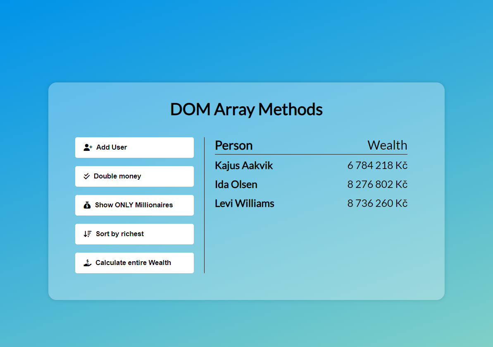

# Udemy--vanillawebprojects-04

**The fourth** of a series of **20 small projects** in **Vanilla JavaScript** from the [**Udemy course**](https://www.udemy.com/course/web-projects-with-vanilla-javascript/) by author [Brad Traversy](https://www.traversymedia.com/) with this [Brad's original GitHub repository](https://github.com/bradtraversy/vanillawebprojects).

# 04: Exchange rate

Select countries to get the exchange rate for a specific amount

## Project Specifications

- Display UI with 2 select lists for countries and 2 inputs for amounts
- Fetch exchange rates from API (https://api.exchangerate-api.com)
- Display the values for both countries
- Update values on amount change
- Swap country rates

## Original preview

    

## My solution preview

    

## My solution features

- Custom **UI/UX design**
- My **FREE API KEY** is no longer working (must be replaced - after your registration on [https://app.exchangerate-api.com/](https:/********/app.exchangerate-api.com/) ) -> replace "const myCurrentAPIkey = ' \*\* \*\* \*\* \*\* \*\* ** ' in **script.js\*\* .
- **FontAwesome** icons

# Author

Website - [Petr Bednarski](https://github.com/pettik)  
Frontend Mentor - [@pettik](https://www.frontendmentor.io/profile/pettik)
